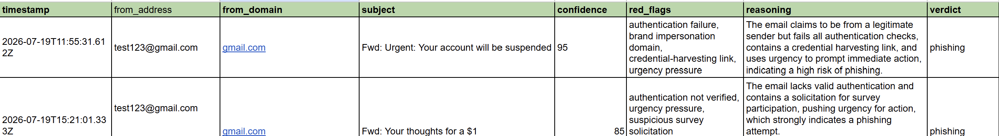

# AI Phishing Detector

An AI-powered phishing detection pipeline built in **n8n**. It extracts email signals deterministically in code, then uses an LLM to reason over the combination of signals — the same way a human SOC analyst weighs multiple weak indicators rather than trusting any single one. Verdicts are logged to Google Sheets and pushed to Telegram in real time.


## Why this design

The core idea is a **split between facts and judgment**:

- **Deterministic feature extraction (code):** domain parsing, DKIM/SPF/DMARC results, reply-to mismatch, URL and link-domain analysis, brand-lookalike detection, credential-harvesting keywords, urgency scoring. These are hard facts computed reliably in JavaScript — never guessed.
- **LLM reasoning (judgment):** the model receives the *extracted features*, not the raw email, and weighs them together into a verdict with a confidence score and an explanation.

This matters because an LLM handed a raw email will guess inconsistently at facts (is this domain real? did auth pass?). By computing the facts first and asking the model only to reason over them, the system is both more accurate and more explainable. The LLM never invents a fact; it only weighs the ones the code produced.

## How it works

```
Gmail Trigger → Feature Extraction (code) → LLM Reasoning → Parse → Log to Sheet
                                                                    └→ If phishing/suspicious → Log + Telegram alert
```

1. **Gmail Trigger** polls for new inbox mail.
2. **Feature Extraction** parses headers, body, links, and authentication results into a structured feature set.
3. **LLM (GPT-4o-mini)** receives the features with a system prompt encoding phishing-analyst reasoning, and returns a strict JSON verdict.
4. **Parse** cleans the response, flattens it, and adds a timestamp and sender address.
5. **Logging** writes every result to an `All_Emails` sheet; phishing/suspicious verdicts are additionally written to a `Phishing_Only` sheet and pushed to **Telegram**.

## Detection signals

See [docs/detection-signals.md](docs/detection-signals.md) for the full reference of every signal the extractor computes and why each matters.

## Screenshots

| Telegram alert | Google Sheet log |
|---|---|
|  |  |

## Understanding email authentication (DKIM / SPF / DMARC)

The detector uses email authentication as a **weighted signal, not a verdict**:

- **SPF** verifies the sending server is authorized for the sender's domain.
- **DKIM** is a cryptographic signature proving the message genuinely came from the domain and wasn't tampered with.
- **DMARC** ties SPF/DKIM back to the visible `From:` domain and sets a policy for failures.

Passing authentication proves a message is *authentic to its sender domain* — it does **not** prove the sender is trustworthy. Attackers routinely register lookalike domains (`bca-verifikasi.xyz`) with fully valid authentication. Conversely, legitimate personal mail often fails these checks. The detector therefore treats authentication as one signal among several and delegates the final weighing to the LLM.

## Testing

The detector was validated in both directions:

- **Legitimate mail** (e.g. authenticated Instagram notifications with many links) → correctly classified `legitimate` at high confidence, without false-flagging high link counts.
- **Phishing** (lookalike domain + credential-harvesting link + urgency + auth failure) → correctly classified `phishing` at 95% confidence with all relevant red flags.
- **Synthetic samples** were constructed to exercise each detection signal individually (lookalike domain, URL shortener, IP-address URL, display-name spoof, urgency).

## Limitations

An honest security tool documents where it breaks:

- **Auth passing ≠ safe.** Attacker-owned lookalike domains pass DKIM/SPF/DMARC. This is why the lookalike/impersonation check exists as a separate signal.
- **Self-sent test emails fail auth.** Gmail-to-Gmail test mail may lack the expected auth markers, producing lower-confidence legitimate verdicts during testing.
- **The lookalike allowlist requires maintenance.** Legitimate brand CDNs (e.g. `cdninstagram.com`) must be allowlisted to avoid false positives; new legitimate domains need to be added over time.
- **Keyword/urgency lists are English/Indonesian-centric** and can be evaded by paraphrase; the LLM layer partially compensates.

## Setup

1. Import `workflow.json` into n8n.
2. Create credentials for **Gmail**, **OpenAI**, **Google Sheets**, and **Telegram**, and select them on the relevant nodes.
3. Create a Google Sheet with two tabs — `All_Emails` and `Phishing_Only` — each with the header row:
   `timestamp | from_address | from_domain | subject | verdict | confidence | red_flags | reasoning`
4. Set the spreadsheet ID on both Google Sheets nodes.
5. Create a Telegram bot via @BotFather, set the bot token and your chat ID on the Telegram node.
6. Activate the workflow.

## Tech stack

n8n · OpenAI GPT-4o-mini · Google Sheets · Telegram Bot API · Gmail API · Docker

---

*Built as a portfolio project exploring practical LLM-assisted security automation. The architecture (deterministic extraction + LLM reasoning) is deliberately chosen to keep the model's role bounded and explainable.*
